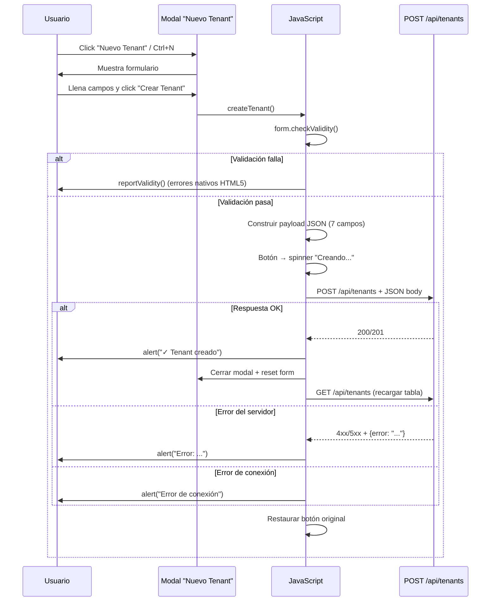

# Análisis: Creación de Tenants en Portal Pilot

## Flujo General de Creación

Ambos archivos (`tenants.html` y `tenants-mejorado.html`) comparten **exactamente la misma lógica** de creación de tenant. Las diferencias son exclusivamente de UI/UX (sidebar colapsable, dark mode toggle, light mode, etc.).

---

## 1. ¿Cómo se abre el formulario?

El usuario puede abrir el modal de creación de 3 formas:

| Método | Código |
|--------|--------|
| Botón "Nuevo Tenant" en topbar | `onclick="openModal('createModal')"` |
| Atajo de teclado | `Ctrl + N` |
| Botón en tabla vacía | `onclick="openModal('createModal')"` |

La función `openModal()` simplemente agrega la clase `active` al overlay:
```javascript
function openModal(id) { document.getElementById(id).classList.add('active'); }
```

---

## 2. Campos del Formulario

El formulario (`id="createTenantForm"`) tiene **7 campos**:

| Campo | ID HTML | Tipo | Requerido | Valor por defecto |
|-------|---------|------|-----------|-------------------|
| Nombre de la Empresa | `t-nombre` | `text` | ✅ Sí | — |
| Dominio | `t-dominio` | `text` | ✅ Sí | — |
| Plan | `t-plan` | `select` | ✅ Sí | `business` (preseleccionado) |
| Email Admin | `t-emailAdmin` | `email` | ✅ Sí | — |
| País | `t-pais` | `select` | ❌ No | `mx` (México preseleccionado) |
| Zona Horaria | `t-zona` | `select` | ❌ No | `America/Mexico_City` |
| Notas Internas | `t-notas` | `textarea` | ❌ No | — |

### Opciones de cada select:

**Plan** (`t-plan`):
- `starter` → Starter
- `business` → Business *(preseleccionado)*
- `enterprise` → Enterprise

**País** (`t-pais`):
- `mx` → México *(preseleccionado)*
- `es` → España
- `co` → Colombia
- `ar` → Argentina
- `us` → Estados Unidos

**Zona Horaria** (`t-zona`):
- `America/Mexico_City` → México (GMT-6) *(preseleccionado)*
- `Europe/Madrid` → España (GMT+1)
- `America/Bogota` → Colombia (GMT-5)
- `America/Argentina/Buenos_Aires` → Argentina (GMT-3)

---

## 3. Función `createTenant()` — Paso a Paso

Ubicación en ambos archivos:
- [tenants.html L1687-1707](file:///c:/Users/DELL/Downloads/Portal-Pilot-WEB/tenants.html#L1687-L1707)
- [tenants-mejorado.html L1749](file:///c:/Users/DELL/Downloads/Portal-Pilot-WEB/tenants-mejorado.html#L1749) (misma lógica, comprimida en una línea)

### Paso 1: Validación del formulario
```javascript
const form = document.getElementById('createTenantForm');
if (!form.checkValidity()) { form.reportValidity(); return; }
```
Usa la validación nativa de HTML5. Si algún campo `required` está vacío o el email es inválido, muestra el error del navegador y **no continúa**.

### Paso 2: Construcción del payload
```javascript
const payload = {
  nombre:     document.getElementById('t-nombre').value.trim(),
  dominio:    document.getElementById('t-dominio').value.trim(),
  plan:       document.getElementById('t-plan').value,
  emailAdmin: document.getElementById('t-emailAdmin').value.trim(),
  pais:       document.getElementById('t-pais').value,
  zonaHoraria: document.getElementById('t-zona').value,
  notas:      document.getElementById('t-notas').value.trim()
};
```

### Paso 3: Feedback visual (loading state)
```javascript
const btn = form.closest('.modal').querySelector('.btn-acc');
const orig = btn.innerHTML;
btn.innerHTML = '<i class="fas fa-spinner fa-spin"></i> Creando...';
btn.disabled = true;
```
El botón cambia a un spinner con "Creando..." y se deshabilita para evitar doble clic.

### Paso 4: Petición HTTP al backend
```javascript
const res = await fetch('/api/tenants', {
  method: 'POST',
  headers: { 'Content-Type': 'application/json' },
  body: JSON.stringify(payload)
});
```

### Paso 5: Manejo de respuesta
- **Si es exitoso (`res.ok`)**: Muestra alerta, cierra modal, resetea form, recarga tabla
- **Si falla**: Parsea el error JSON y muestra mensaje
- **Si hay error de conexión**: Muestra "Error de conexión. Usando modo desarrollo."

### Paso 6: Restaurar botón
```javascript
btn.innerHTML = orig;
btn.disabled = false;
```

---

## 4. ¿Qué se envía exactamente?

### Endpoint
```
POST /api/tenants
```

### Headers
```json
{
  "Content-Type": "application/json"
}
```

> [!WARNING]
> **No se envía el token de autenticación** en la creación del tenant. El `fetchTenants()` (GET) sí incluye `Authorization: Bearer ${token}`, pero el `createTenant()` (POST) **no lo incluye**. Esto es un posible bug en ambos archivos.

### Body (ejemplo)
```json
{
  "nombre": "TechCorp Solutions",
  "dominio": "techcorp.portalpilot.io",
  "plan": "business",
  "emailAdmin": "admin@techcorp.com",
  "pais": "mx",
  "zonaHoraria": "America/Mexico_City",
  "notas": "Cliente VIP, requiere SLA premium"
}
```

---

## 5. Diferencias entre `tenants.html` y `tenants-mejorado.html`

### La lógica de creación es IDÉNTICA ✅

Ambos archivos usan exactamente el **mismo formulario**, el **mismo payload**, el **mismo endpoint** y la **misma función `createTenant()`**.

### Las diferencias son puramente de UI/UX:

| Feature | `tenants.html` | `tenants-mejorado.html` |
|---------|----------------|-------------------------|
| Sidebar | Fija 240px, toggle solo mobile | Colapsable con animación (`260px` ↔ `72px`) |
| CSS Variables | `--sidebar-width` no definida | `--sidebar-width: 260px`, `--sidebar-collapsed: 72px`, `--transition` |
| Dark/Light Mode | No tiene toggle | Toggle con botón en sidebar footer |
| Perfil en sidebar | Avatar con iniciales | Foto real (``) con borde accent |
| Modal Logout | No tiene | Modal dedicado con confirmación |
| Overlay para mobile | No tiene | `<div class="overlay">` para cerrar sidebar |
| Sidebar toggle button | Hamburger icon solo mobile | Botón circular en el borde con líneas decorativas |
| Scrollbar | `4px`, solo thumb | `10px`, gradiente, hover con glow |
| Posición de modales | Antes del dashboard (L1289) | Después del dashboard (L1614) |
| Responsive | `sidebar.open` class | `sidebar.active` class |
| `fetchTenants()` fallback | Asigna a `allTenants` (variable no usada) | Usa `getMockTenants()` como fallback |
| Código JS | Legible, con indentación | Comprimido, una función por línea |

> [!IMPORTANT]
> En `tenants.html`, el `fetchTenants()` asigna la respuesta a `allTenants` (L1583), pero la variable global declarada es `tenants` (L1559). Esto significa que si la API responde correctamente, los datos **no se guardarán en la variable correcta** y las funciones de filtrado/sorting no funcionarán. En `tenants-mejorado.html` esto está **corregido** — asigna a `tenants` directamente (L1735).

---

## 6. Diagrama del Flujo Completo



---

## 7. Resumen

| Aspecto | Valor |
|---------|-------|
| **Endpoint** | `POST /api/tenants` |
| **Método** | `POST` |
| **Content-Type** | `application/json` |
| **Auth Header** | ⚠️ No incluido (posible bug) |
| **Campos requeridos** | `nombre`, `dominio`, `plan`, `emailAdmin` |
| **Campos opcionales** | `pais`, `zonaHoraria`, `notas` |
| **Validación** | HTML5 nativa (`required`, `type="email"`) |
| **Loading state** | Spinner en botón + disabled |
| **Post-creación** | Cierra modal → reset form → `fetchTenants()` |
